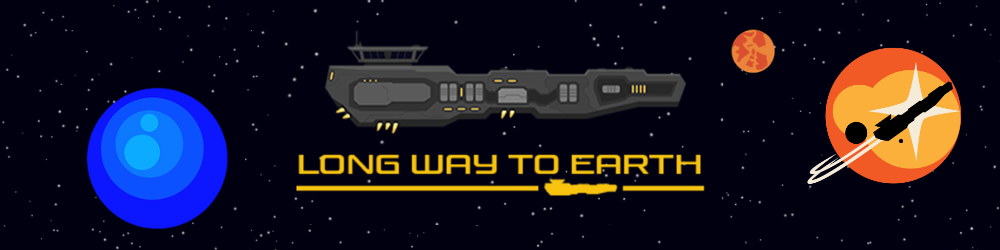

## 📝 About

"Long Way to Earth" is a highly narrative-focused management game.  
It emphasizes the psychological dimension of an interstellar journey.

## 🏎️ Main feature

I had the chance to develop a storytelling tool during the production of this project, using the Unity UI and mainly the shader window and its mechanics.  
It allows you to integrate lines of dialogue or tasks with which the player will have to interact.  
So it became the central structure of our project, and we took advantage of the ease that windows provide, precise visibility and tasks all in one place, to make the production of our tasks more fluid. 

## 💼 What I've done

| Name             | Description                             |
| :--------------: | :-------------------------------:       |
| Narration Tool   | Tool for integrating dialogues and player tasks |
| Save & Load      | Mechanism for saving and loading a game |
| Linking systems  | Linking up all the systems to refocus the tool at the center of the project |
| Debug            | Debugging problems and playtesting      |

## 🔗 Links

